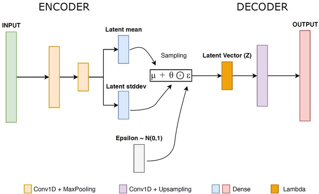
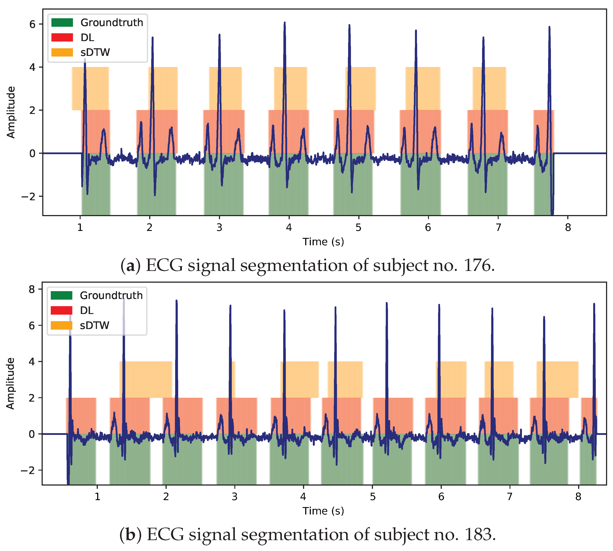
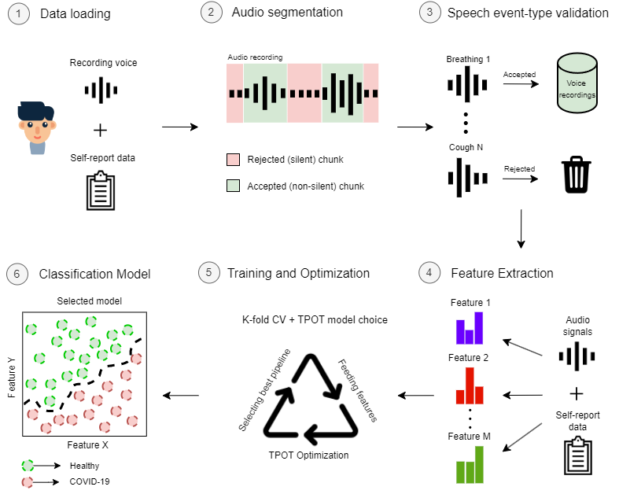
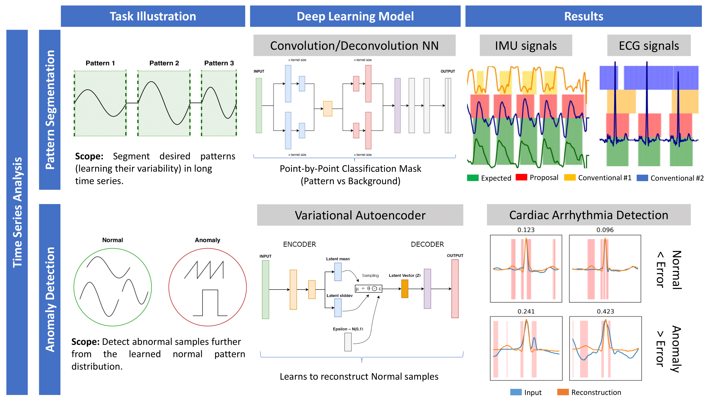
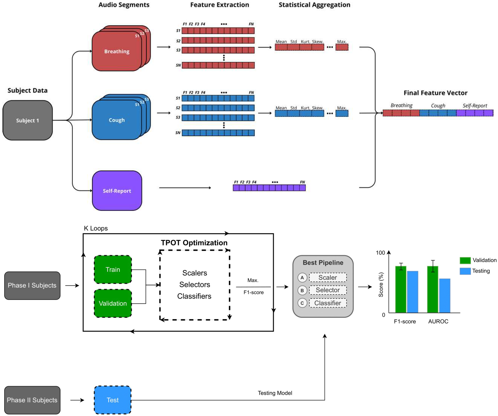
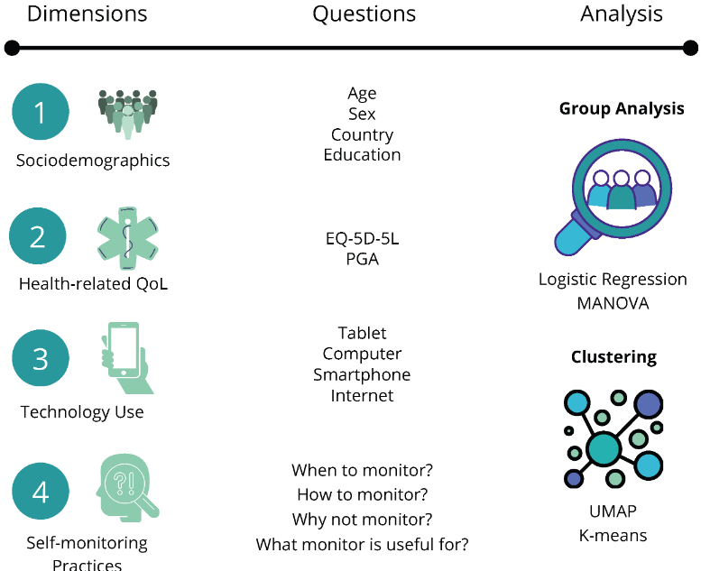
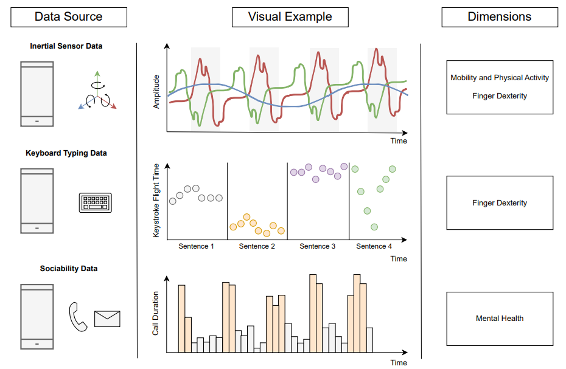

## Publications

#### 1. **Robust Anomaly Detection in Time Series through Variational AutoEncoders and a Local Similarity Score**
Developed an unsupervised framework using Variational Autoencoder coupled with a local similarity score for anomaly detection in time series data. Achieved superior performance on ECG5000 and MIT-BIH Arrhythmia datasets, with an AUC score of 98.79% and significant improvement in detection with cleaning and optimization techniques. Check the publication
[here](https://www.researchgate.net/publication/349383970_Robust_Anomaly_Detection_in_Time_Series_through_Variational_AutoEncoders_and_a_Local_Similarity_Score).

#### 2. **Time Series Segmentation using Neural Networks with Cross-Domain Transfer Learning**
Introduced a Mask-based Neural Network for extracting patterns from time series without predefined templates, demonstrating enhanced segmentation performance compared to traditional methods. Utilized transfer learning and data augmentation techniques for model convergence, achieving high Precision and Recall scores in clinical and human activity domains. Check the publication
[here](https://www.mdpi.com/2079-9292/10/15/1805).

#### 3. **Clinically Relevant Sound-based Features in COVID-19 Identification: Robustness Assessment with a Data-Centric Machine Learning Pipeline**
Developed a modular data-centric Machine Learning pipeline for COVID-19 identification from vocal and respiratory audio samples, achieving sensitivity scores ranging from 60.00% to 80.00%. Emphasized the importance of interpretable features and data quality validation for effective disease identification. Check the publication 
[here](https://ieeexplore.ieee.org/document/9906975).

#### 4. **Flexible Time Series Matching for Clinical and Behavioral Data**
Proposed Deep Learning frameworks for pattern segmentation and anomaly detection in time series data. Demonstrated superior flexibility and performance compared to traditional methods in detecting targeted patterns and identifying abnormalities in noisy and variable datasets. Check the publication
[here](https://run.unl.pt/handle/10362/157934).

#### 5. **Acoustic and Clinical Data Analysis of Vocal Recordings: Pandemic Insights and Lessons**
This study integrates audio processing, feature engineering, and ML classification models to analyze vocal recordings during the pandemic, exploring associations between vocal features and COVID-19 infections. Insights offer valuable lessons for future health crises. Check the publication [here](https://www.mdpi.com/2075-4418/14/20/2273).

#### 6. **Self-Monitoring Practices and Use of Self-Monitoring Technologies by People with Rheumatic and Musculoskeletal Diseases**
An international survey studying the self-monitoring behaviors of individuals with rheumatic and musculoskeletal diseases, focusing on the role of technology. Classical statistical analyses were carried out in the scope of this work. Check the publication [here](https://www.mdpi.com/2227-9032/12/19/1960).

#### 7. **COTIDIANA Dataset – Smartphone-Collected Data on the Mobility, Finger Dexterity, and Mental Health**
This dataset captures smartphone-collected data on mobility, finger dexterity, and mental health in patients with rheumatic and musculoskeletal diseases, enabling digital health research. Check the publication [here](https://ieeexplore.ieee.org/document/10669778).

